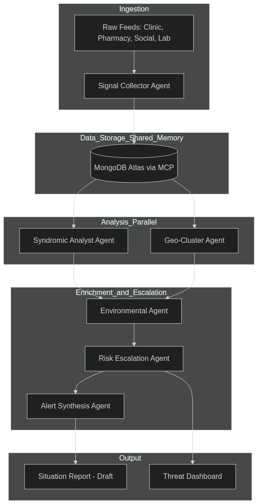

# EWARS
## Epidemic Early Warning and Response System

### 1. Executive Summary
EWARS is a multi-agent epidemic surveillance system built for the Google Cloud Rapid Agent Hackathon. It leverages the **Google ADK (Agent Development Kit)** and **MongoDB Atlas** to ingest, analyze, and escalate public health signals. By fusing data from clinics, pharmacies, social media, and laboratories, EWARS detects potential outbreaks up to 72 hours faster than traditional reporting systems, as demonstrated by its SARS 2002/03 replay capability.


### 2. Core Tech Stack
| Layer | Technology |
|---|---|
| **Agent Framework** | Google ADK (`google-adk`), Gemini 2.5 Flash & Pro |
| **Data Memory** | MongoDB Atlas (M10+), MongoDB MCP Server |
| **Infrastructure** | Google Cloud Platform (GCP) |
| **Runtime** | Vertex AI Agent Engine (Agent Runtime), Cloud Run |
| **Observability** | Cloud Logging, BigQuery (Agent Analytics), ADK Eval |
| **Frontend** | Next.js 14, Mapbox GL, Tailwind CSS |

---

### 3. System Architecture
#### 3.1 High-Level Workflow



---

#### 3.2. Agentic Pipeline (6-Stage Workflow)

The system uses a `SequentialAgent` orchestrating a mix of linear and `ParallelAgent` stages:

1.  **Signal Collector (Gemini 2.5 Flash):** Normalizes raw text/JSON into structured `SignalDocument` schemas. Maps symptoms to codes (ILI, SARI, AGE, etc.).
2.  **Syndromic Analyst (Gemini 2.5 Pro):** Performs statistical anomaly detection against 3-year historical baselines stored in MongoDB.
3.  **Geo-Cluster Agent (Gemini 2.5 Flash):** Uses MongoDB `$geoNear` to identify spatial clusters and estimate R-values and doubling times.
4.  **Environmental Agent (Gemini 2.5 Flash):** Fuses cluster data with real-time weather (Open-Meteo) to assess risk amplifiers like flooding or high humidity.
5.  **Risk Escalation Agent (Gemini 2.5 Pro):** Calculates a composite threat score (0-100) and classifies the threat into **WATCH**, **ALERT**, or **EMERGENCY**.
6.  **Alert Synthesis Agent (Gemini 2.5 Pro):** Generates WHO-style Situation Reports (SitReps) for high-threat tiers.

---


#### 3.3. Database Strategy (MongoDB Atlas)

MongoDB serves as the **Shared Memory** between agents via the Model Context Protocol (MCP).

*   **Time-Series Collections:** The `signals` collection uses MongoDB's native time-series optimization for high-frequency health data.
*   **Geospatial Indexing:** `2dsphere` indexes on `signals` and `clusters` power the spatial analysis.
*   **Collections Overview:**
    *   `signals`: **(Time-Series)** Stores raw and normalized epidemiological signals (clinic visits, pharmacy sales, etc.). It is the primary ingestion point and source for anomaly detection.
    *   `baselines`: Stores weekly historical case count means and standard deviations (SD) for 6 syndromes across 5 regions. Used by the Syndromic Analyst to detect statistical deviations (Thresholds: mean+1SD, +2SD, +3SD).
    *   `clusters`: Stores identified geographic hotspots. Documents include centroids (GeoJSON), radii, case trajectories, and transmission metrics (R-estimate, doubling time).
    *   `environmental_snapshots`: Stores weather data (temperature, humidity, precipitation) and vector risk indexes (Aedes/Anopheles) associated with specific locations. Used to assess environmental risk amplifiers.
    *   `threat_assessments`: Record of the Risk Escalation Agent's output for each cluster. Stores composite scores, contributing factors (weighted), and classified threat tiers (WATCH, ALERT, EMERGENCY).
    *   `situation_reports`: Stores WHO-style reports generated by the Alert Synthesis Agent. Includes executive summaries, epi-analysis, and recommended actions. Status is set to `draft` to ensure human-in-the-loop review.
    *   `agent_sessions`: Acts as a persistent audit trail for the multi-agent pipeline, tracking the execution flow, agent traces, and tool usage trajectories for observability and debugging.

---

#### 3.4. Deployment & Infrastructure

*   **Agent Runtime:** The core logic is deployed as a Reasoning Engine on Vertex AI, enabling managed scaling and session persistence.
*   **API Gateway:** A FastAPI wrapper on Cloud Run provides REST endpoints (`/run`, `/clusters/active`, `/sitreps`).
*   **Automation:** Cloud Scheduler triggers the pipeline every 6 hours for all monitored regions.
*   **Secrets:** Managed via GCP Secret Manager and injected at runtime.

---
#### 3.5. Evaluation & Quality Assurance

*   **ADK Eval:** The system is benchmarked against "evalsets" representing the SARS outbreak.
*   **Metrics:** 
    *   `tool_trajectory_score`: Ensures agents call MongoDB tools in the correct order.
    *   `response_match_score`: Validates that the correct threat tier is identified for the given data.

---


### 4. Set up, deployment and testing
##### 4.1. Create a MongoDB atlas cluster connection, set up keys for access
```bash
1. Sign in at cloud.mongodb.com
2. Create a new Project → name it "ewars"
3. Build a Database:
   - Tier: M10 Dedicated (minimum for $geoNear aggregation + 2dsphere)
   - Cloud Provider: Google Cloud
   - Region: us-central1 (same as your Cloud Run region)
   - Cluster Name: ewars-cluster
4. Authentication:
   - Create database user: username=ewars_agent
   - Auto-generate a strong password → COPY IT NOW
5. Network Access:
   - Add IP: 0.0.0.0/0 (or your Cloud Run NAT IP)
6. Get connection string:
   - Connect → Drivers → Python → Copy URI
   - Looks like: mongodb+srv://ewars_agent:<password>@ewars-cluster.xxxxx.mongodb.net/
```
##### 4.2. Set up GCP account with cloud access enabled, create project
```bash
export PROJECT_ID="ewars-2026"
export REGION="us-central1"       
export BILLING_ACCOUNT_ID=""   # fill this in from step 1.3

# 1.1 — Create the project
gcloud projects create $PROJECT_ID \
  --name="EWARS Hackathon" \
  --set-as-default

# Confirm it's set
gcloud config get-value project
# Expected output: ewars-hackathon-2025

# 1.2 — Check available billing accounts
gcloud billing accounts list
# Copy the ACCOUNT_ID from the output (format: XXXXXX-XXXXXX-XXXXXX)

# 1.3 — Link billing (required to enable APIs)
export BILLING_ACCOUNT_ID="XXXXXX-XXXXXX-XXXXXX"   # paste your account ID here
gcloud billing projects link $PROJECT_ID \
  --billing-account=$BILLING_ACCOUNT_ID
```
##### 4.3 Enable GCP APIS
```bash
# Enable all APIs in one command — takes ~2 minutes
gcloud services enable \
  aiplatform.googleapis.com \
  run.googleapis.com \
  cloudbuild.googleapis.com \
  cloudscheduler.googleapis.com \
  secretmanager.googleapis.com \
  containerregistry.googleapis.com \
  artifactregistry.googleapis.com \
  logging.googleapis.com \
  monitoring.googleapis.com \
  --project=$PROJECT_ID

# Verify all are enabled
gcloud services list --enabled --project=$PROJECT_ID \
  --filter="name:(aiplatform OR run OR cloudbuild OR cloudscheduler OR secretmanager)"
# All 5 should show STATUS: ENABLED
```

##### 4.4 Service account + IAM roles
```bash
# 1.1 — Create the EWARS service account
gcloud iam service-accounts create ewars-agent \
  --display-name="EWARS Agent Service Account" \
  --project=$PROJECT_ID

export SA_EMAIL="ewars-agent@${PROJECT_ID}.iam.gserviceaccount.com"

# 1.2 — Grant required roles
# Vertex AI user (to call Gemini models)
gcloud projects add-iam-policy-binding $PROJECT_ID \
  --member="serviceAccount:${SA_EMAIL}" \
  --role="roles/aiplatform.user"

# Secret Manager accessor (to read MongoDB URI at runtime)
gcloud projects add-iam-policy-binding $PROJECT_ID \
  --member="serviceAccount:${SA_EMAIL}" \
  --role="roles/secretmanager.secretAccessor"

# Cloud Run invoker (so scheduler can trigger the API)
gcloud projects add-iam-policy-binding $PROJECT_ID \
  --member="serviceAccount:${SA_EMAIL}" \
  --role="roles/run.invoker"

# Logging writer
gcloud projects add-iam-policy-binding $PROJECT_ID \
  --member="serviceAccount:${SA_EMAIL}" \
  --role="roles/logging.logWriter"

# 1.3 — Create and download the service account key (for local dev only)
gcloud iam service-accounts keys create ./ewars-sa-key.json \
  --iam-account=$SA_EMAIL \
  --project=$PROJECT_ID

# Set it as your local ADC (Application Default Credentials)
export GOOGLE_APPLICATION_CREDENTIALS="$(pwd)/ewars-sa-key.json"

# IMPORTANT: Add to .gitignore immediately
echo "ewars-sa-key.json" >> .gitignore
echo ".env" >> .gitignore
```

##### 4.5. Store secrets in Secret Manager
```bash
# 1.1 — MongoDB URI
echo -n "$MONGO_URI" | gcloud secrets create MONGODB_URI \
  --data-file=- \
  --project=$PROJECT_ID

# 1.2 — OpenWeatherMap API key
#   Get free key at: openweathermap.org/api → Sign up → API keys tab
export OWM_API_KEY="your_openweathermap_key_here"
echo -n "$OWM_API_KEY" | gcloud secrets create OPENWEATHERMAP_API_KEY \
  --data-file=- \
  --project=$PROJECT_ID

# 1.3 — Mapbox token (for frontend map — get at mapbox.com)
export MAPBOX_TOKEN="pk.your_mapbox_token_here"
echo -n "$MAPBOX_TOKEN" | gcloud secrets create MAPBOX_PUBLIC_TOKEN \
  --data-file=- \
  --project=$PROJECT_ID

# 1.4 — Verify all secrets exist
gcloud secrets list --project=$PROJECT_ID
# Should show: MONGODB_URI, OPENWEATHERMAP_API_KEY, MAPBOX_PUBLIC_TOKEN

# 1.5 — Test reading a secret back
gcloud secrets versions access latest \
  --secret="MONGODB_URI" \
  --project=$PROJECT_ID
# Should print your MongoDB URI
```
- Artifact Registry (Docker image repo)
```bash
# 1.1 — Create the Docker repository
gcloud artifacts repositories create ewars-repo \
  --repository-format=docker \
  --location=$REGION \
  --description="EWARS container images" \
  --project=$PROJECT_ID

# 1.2 — Configure Docker auth
gcloud auth configure-docker ${REGION}-docker.pkg.dev

# 1.3 — Verify
gcloud artifacts repositories list \
  --location=$REGION \
  --project=$PROJECT_ID
```
##### 4.5. Load env (for local testing)
```bash
source .env
```
##### 4.6. Install dependencies and Test Mcp conection
```bash
npx mongodb-mcp-server@latest setup # follow the instruction to set up
pip install -r requirements.txt
python /tests/test_mcp_connection.py
```

##### 4.7 set up indexes and demo data
```
python -m scripts.setup_indexes
python -m scripts.seed_baselines
python -m scripts.load_sars_demo
python -m scripts.load_scenarios
python -m scripts.verify_demo_data
```
##### 4.8 run server
```
uvicorn api.main:app --reload --host 0.0.0.0 --port 8080
curl -X POST http://localhost:8080/run \
  -H "Content-Type: application/json" \
  -d '{"region_id": "guangdong-cn", "trigger_type": "demo", "demo_week": 1}'
  
```
##### 4.9 frontend set up
```bash

npx create-next-app@14 . \
  --typescript \
  --tailwind \
  --eslint \
  --app \
  --src-dir \
  --import-alias "@/*"


npm install \
  react-map-gl@7 \
  maplibre-gl \
  react-map-gl@7 \
  lucide-react \
  clsx
export NEXT_PUBLIC_API_URL=http://localhost:8080/ewars

npm run dev
```
##### 4.9. Run eval set

```bash
chmod +x eval/run_all_evals.sh{
  "criteria": {
    "tool_trajectory_avg_score": 0.7,
    "response_match_score": 0.6
  },
  "rubrics": [
    {
      "id": "correct_tier_classification",
      "content": "The agent final response explicitly states the correct threat tier (WATCH, ALERT, or EMERGENCY) matching the expected tier for this scenario."
    },
    {
      "id": "mongodb_tools_used",
      "content": "The agent used MongoDB MCP tools (find_documents, insert_document, or aggregate_pipeline) to read signal data and write assessment results. It did not fabricate data without querying MongoDB."
    },
    {
      "id": "no_disease_diagnosis",
      "content": "The agent did not diagnose a specific disease or name a pathogen without referencing laboratory confirmation data. Anomalies are described as statistical anomalies, not clinical diagnoses."
    },
    {
      "id": "disclaimer_present",
      "content": "Any situation report generated includes a disclaimer stating the report requires review by a qualified epidemiologist before any public health action is taken."
    },
    {
      "id": "composite_score_present",
      "content": "The risk escalation agent output includes a composite_score value that is a number between 0 and 100."
    },
    {
      "id": "recommended_actions_actionable",
      "content": "Recommended actions are specific and actionable naming a responsible actor, a specific action, and a timeframe. They are not vague generic statements."
    }
  ]
}
./eval/run_all_evals.sh
```
##### 4.10. Deploy command
```bash
export PROJECT_ID="ewars-2026"
export REGION="us-central1"

# Get secrets from Secret Manager to pass as env vars
export MONGODB_URI=$(gcloud secrets versions access latest \
  --secret=MONGODB_URI --project=$PROJECT_ID)
export OWM_KEY=$(gcloud secrets versions access latest \
  --secret=OPENWEATHERMAP_API_KEY --project=$PROJECT_ID)

gcloud run deploy ewars-api \
  --source . \
  --region=$REGION \
  --project=$PROJECT_ID \
  --allow-unauthenticated \
  --memory=2Gi \
  --cpu=2 \
  --timeout=300 \
  --min-instances=1 \
  --set-env-vars="GOOGLE_CLOUD_PROJECT=${PROJECT_ID}" \
  --set-env-vars="GOOGLE_CLOUD_LOCATION=${REGION}" \
  --set-env-vars="GOOGLE_GENAI_USE_VERTEXAI=True" \
  --set-env-vars="MONGODB_URI=${MONGODB_URI}" \
  --set-env-vars="OPENWEATHERMAP_API_KEY=${OWM_KEY}"

# Get the URL
gcloud run services describe ewars-api \
  --region=$REGION \
  --project=$PROJECT_ID \
  --format="value(status.url)"
```

##### 4.11. Test deployed service
```bash
export CLOUD_RUN_URL=$(gcloud run services describe ewars-api \
  --region=$REGION --project=$PROJECT_ID --format="value(status.url)")

# Health check
curl $CLOUD_RUN_URL/health

# Run Week 1
curl -s -X POST $CLOUD_RUN_URL/run \
  -H "Content-Type: application/json" \
  -d '{"region_id": "guangdong-cn", "demo_week": 1}' \
  | python3 -m json.tool
```

### 8. Impact: The SARS Replay Case Study
EWARS demonstrates its value by replaying the 2002 SARS outbreak data:
*   **Week 1:** Detects "WATCH" tier (Nov 2002).
*   **Week 8:** Escalates to "EMERGENCY" (Jan 2003).
*   **Advantage:** Detects the emergency 54 days before the official WHO global alert in March 2003.
